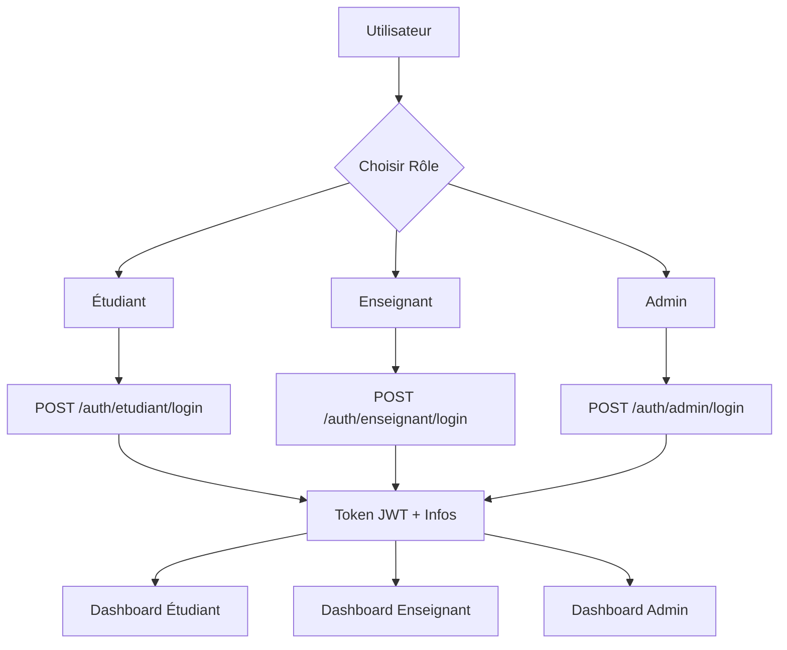

# � Bull ASUR - Documentation Complète

## 📋 Vue d'ensemble

Système de gestion académique complet avec backend NestJS et frontend React. Documentation optimisée pour une intégration rapide et efficace.

---

## � Structure des Fichiers

### **1. � README.md** (Ce fichier)
- Vue d'ensemble du projet
- Instructions d'installation rapide
- Architecture et stack technique
- Workflow de développement

### **2. 📡 API_ENDPOINTS.md**
- 64+ endpoints API complets
- Exemples de requêtes/réponses
- Authentification JWT
- Permissions par rôle

### **3. 🔐 FRONTEND_INTEGRATION.md**
- Guide complet d'intégration React
- Service d'authentification
- Composants protégés
- Exemples de code TypeScript

---

## 🛠️ Stack Technique

### **Backend**
- **Framework**: NestJS + TypeScript
- **Base**: PostgreSQL + Prisma ORM
- **Authentification**: JWT Bearer Token
- **API**: RESTful + Swagger Documentation

### **Frontend**
- **Framework**: React 18 + TypeScript
- **Routing**: React Router v6
- **HTTP Client**: Axios
- **Styling**: TailwindCSS
- **Forms**: React Hook Form

---

## 🚀 Installation Rapide

### **Backend**
```bash
# Cloner et démarrer
git clone <repo>
cd Bull_ASUR
npm install
npm run start:dev

# Disponible sur http://localhost:5000
# Documentation: http://localhost:5000/api/docs
```

### **Frontend**
```bash
# Créer le projet
npx create-react-app bull-asur-frontend --template typescript
cd bull-asur-frontend

# Installer les dépendances
npm install axios react-router-dom react-hook-form @hookform/resolvers yup
npm install -D tailwindcss postcss autoprefixer
npx tailwindcss init -p

# Démarrer
npm start
# Disponible sur http://localhost:3000
```

---

## 🔐 Flux d'Authentification



---

## 🛠️ Stack Technique

### **Backend**
- **Framework** : NestJS
- **Base** : PostgreSQL + Prisma ORM
- **Authentification** : JWT Bearer Token
- **API** : RESTful + Swagger Documentation

### **Frontend (Recommandé)**
- **Framework** : React 18+
- **Routing** : React Router v6
- **HTTP Client** : Axios
- **State Management** : React Hooks + Context

---

## 🔐 Sécurité

### **JWT Structure**
```json
{
  "sub": "user_id",
  "email": "user@email.com", 
  "role": "ETUDIANT|ENSEIGNANT|ADMINISTRATEUR",
  "iat": 1640000000,
  "exp": 1640003600
}
```

### **Rôles et Permissions**
| Rôle | Étudiants | Enseignants | Matières | UE | Semestres | Évaluations | Admin |
|-------|-----------|-------------|----------|-----|-----------|------------|-------|
| **ETUDIANT** | Lecture soi-même | ❌ | ❌ | ❌ | ❌ | Lecture | ❌ |
| **ENSEIGNANT** | Lecture | Lecture | ❌ | ❌ | ❌ | CRUD | ❌ |
| **SECRETARIAT** | CRUD | CRUD | CRUD | CRUD | CRUD | CRUD | ❌ |
| **ADMIN** | CRUD | CRUD | CRUD | CRUD | CRUD | CRUD | ✅ |

---

## 📊 Fonctionnalités Clés

### **✅ Implémentées**
- Authentification JWT multi-rôles
- CRUD complet pour toutes les entités
- Calculs académiques automatiques
- Validation rattrapage (< 6)
- Règle des 2 meilleures notes
- Documentation Swagger complète

### **🔄 Logique Métier**
- **Rattrapage** : Uniquement si moyenne initiale < 6
- **Calcul matière** : Moyenne des 2 meilleures notes (CC/Examen/Rattrapage)
- **Calcul UE** : Moyenne pondérée des matières
- **Calcul semestre** : Moyenne pondérée des UE
- **Recalcul automatique** : Après chaque évaluation

---

## 🚀 Déploiement

### **Environnement de développement**
```bash
# Backend (Port 5000)
npm run start:dev

# Frontend (Port 3000) 
npm start

# Documentation
http://localhost:5000/api/docs
```

### **Configuration requise**
```javascript
// Frontend
const API_CONFIG = {
  baseURL: 'http://localhost:5000',
  timeout: 10000,
  headers: {
    'Content-Type': 'application/json'
  }
};
```

---

## 📱 Exemples d'Utilisation

### **1. Connexion étudiant**
```javascript
const loginEtudiant = async () => {
  const response = await fetch('http://localhost:5000/auth/etudiant/login', {
    method: 'POST',
    headers: { 'Content-Type': 'application/json' },
    body: JSON.stringify({
      nom: 'mmartin2024',
      password: 'password123'
    })
  });
  
  const { access_token, etudiant } = await response.json();
  localStorage.setItem('token', access_token);
  localStorage.setItem('user', JSON.stringify(etudiant));
};
```

### **2. Lister les matières**
```javascript
const getMatieres = async () => {
  const token = localStorage.getItem('token');
  const response = await fetch('http://localhost:5000/matieres', {
    headers: { 
      'Authorization': `Bearer ${token}`,
      'Content-Type': 'application/json'
    }
  });
  
  return await response.json();
};
```

### **3. Créer une évaluation**
```javascript
const createEvaluation = async (evaluationData) => {
  const token = localStorage.getItem('token');
  const response = await fetch('http://localhost:5000/evaluations', {
    method: 'POST',
    headers: { 
      'Authorization': `Bearer ${token}`,
      'Content-Type': 'application/json'
    },
    body: JSON.stringify(evaluationData)
  });
  
  return await response.json();
};
```

---

## 🎯 Points d'Accès

### 🌐 URLs de l'API

**Production** ✅ : `https://bull-back-z97c.onrender.com`
**Documentation** : `https://bull-back-z97c.onrender.com/api/docs`
**Health** : `https://bull-back-z97c.onrender.com/health`

**Développement** : `http://localhost:3002`
**Réseau** : `http://0.0.0.0:3002`

### **Identifiants de test**
| Rôle | Nom d'utilisateur | Mot de passe | Dashboard |
|-------|----------------|-------------|----------|
| Admin | root | root | /admin/dashboard |
| Secretariat | admin | admin | /admin/dashboard |
| Étudiant | mmartin2024 | password123 | /student/dashboard |
| Enseignant | jdupontweb | password123 | /teacher/dashboard |

---

## 📞 Support et Débogage

### **Erreurs courantes**
- **CORS** : Vérifier que le backend tourne
- **401 Unauthorized** : Token invalide ou expiré
- **403 Forbidden** : Rôle insuffisant
- **Rattrapage refusé** : Moyenne ≥ 6

### **Outils de développement**
- **Postman** : Tester les endpoints
- **React DevTools** : Déboguer le frontend
- **Network Tab** : Vérifier les requêtes HTTP

---

## 🔄 Workflow de Développement

### **Phase 1 : Setup**
1. Cloner le projet frontend
2. Configurer les variables d'environnement
3. Installer les dépendances
4. Configurer le service API

### **Phase 2 : Authentification**
1. Implémenter le composant Login
2. Gérer les tokens JWT
3. Créer les routes protégées
4. Tester tous les rôles

### **Phase 3 : Fonctionnalités**
1. Tableaux de bord par rôle
2. CRUD des entités
3. Calculs académiques
4. Gestion des erreurs

### **Phase 4 : Tests**
1. Tests E2E complets
2. Tests unitaires
3. Tests d'intégration API
4. Validation responsive

---

## 🎓 Checklist de Livraison

- [ ] Authentification multi-rôles fonctionnelle
- [ ] Tableaux de bord implémentés
- [ ] CRUD entités opérationnels
- [ ] Calculs académiques validés
- [ ] Gestion erreurs robuste
- [ ] Documentation utilisateur complète
- [ ] Tests E2E rédigés
- [ ] Déploiement production prêt

---

## 📈 Évolutions Futures

### **Version 2.0**
- [ ] Refresh tokens automatiques
- [ ] Notifications temps réel
- [ ] Export PDF bulletins
- [ ] Mode hors ligne
- [ ] API mobile

### **Améliorations**
- [ ] Cache des requêtes
- [ ] Pagination des listes
- [ ] Recherche avancée
- [ ] Graphiques statistiques

---

## 📞 Contact Support

### **Documentation technique**
- **API complète** : Voir [API_ENDPOINTS.md](./API_ENDPOINTS.md)
- **Swagger interactif** : http://localhost:5000/api/docs
- **Exemples de code** : Voir [CONNEXION_FRONTEND.md](./CONNEXION_FRONTEND.md)

### **Aide développement**
- **Backend prêt** : Port 5000
- **Base de données** : PostgreSQL avec Prisma
- **Architecture** : RESTful + JWT

---

**🚀 Prêt à développer !**

Cette documentation fournit tous les éléments nécessaires pour créer un frontend complet et fonctionnel avec l'API Bull ASUR.
